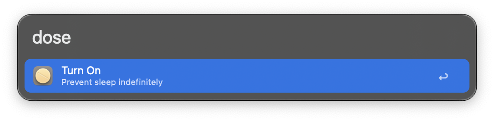
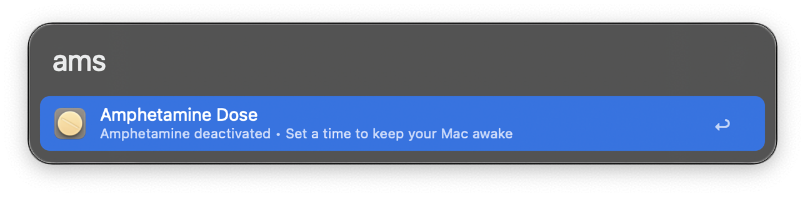
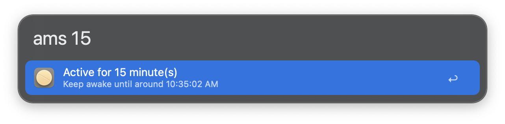

#  Amphetamine Dose | Alfred Workflow

Control the [Amphetamine app](https://apps.apple.com/us/app/amphetamine/id937984704?mt=12) straight from Alfred. Start or stop sessions and set how long your Mac should stay awake, all without lifting your hands from the keyboard.

## Download

- Available on the Alfred Gallery. [Get it here](https://alfred.app/workflows/vanstrouble/amphetamine-dose/).
- Download it directly [from GitHub here](https://github.com/vanstrouble/dose-alfred-workflow/releases/latest).

**Prefer to keep it native? _Caffeine Dose_ uses `caffeinate`, built right into macOS. [Try it here](https://github.com/vanstrouble/caffeine-dose-alfred-workflow.git).**

## Usage

### Toggle Amphetamine on or off (`dose`)

Use the `dose` keyword to toggle Amphetamine on or off, preventing macOS from sleeping.

- **Keyword:** `dose`

Hold **Command (⌘)** to allow the display to sleep during the session.

### All-in-one command (`ams`)

The `ams` command lets you keep your Mac awake for a specific duration or until a set time, directly from Alfred. It also shows a clear status indicator so you always know if a session is active.

**Key features:**
- Flexible input: set minutes, hours, or a specific time (e.g., `ams 15`, `ams 2h`, `ams 9:30pm`).
- Natural language support for durations and times.
- Simple status display: see if Amphetamine is active or inactive at a glance.

- **Keyword:** `ams [duration or time]`

Hold **Command (⌘)** while using `ams` to allow the display to sleep during the session.

#### Examples

| Command       | Description                                      |
|---------------|--------------------------------------------------|
| `ams s`       | Shows status, time left, and if display can sleep. |
| `ams d`       | Deactivates the current session.                 |
| `ams i`       | Keeps your Mac awake indefinitely.               |
| `ams 15`      | Keeps your Mac awake for 15 minutes.             |
| `ams 2h`      | Keeps your Mac awake for 2 hours.                |
| `ams 1 30`    | Keeps your Mac awake for 1 hour and 30 minutes.  |
| `ams 9:30`    | Keeps your Mac awake until the next 9:30.        |
| `ams 8am`     | Keeps your Mac awake until 8:00 AM.              |
| `ams 11:40pm` | Keeps your Mac awake until 11:40 PM.             |

The `ams` command supports both 12-hour (AM/PM) and 24-hour time formats.

### Customization

**Keywords**

Both `dose` and `ams` commands can be customized in the workflow settings. You can modify their keywords or behavior to better suit your needs.

**Time format**

Set to 12-hour (AM/PM) or 24-hour in the workflow settings. This changes how times are shown in notifications and status.

**Hotkeys**

Set hotkeys for quick and direct actions, like toggling Amphetamine or starting a session instantly.
